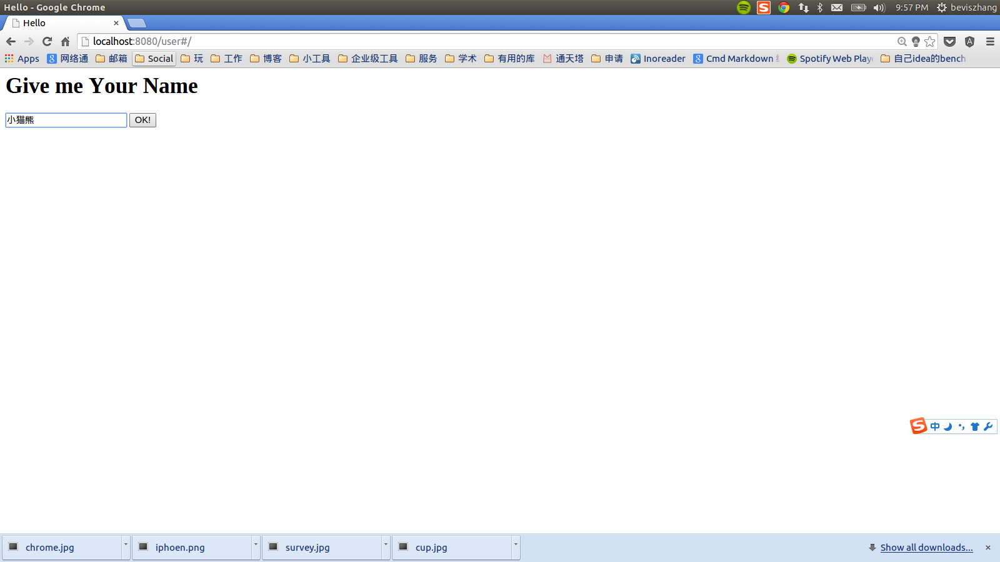
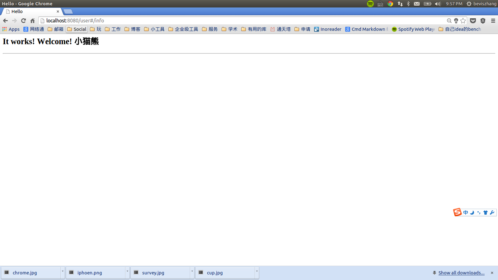
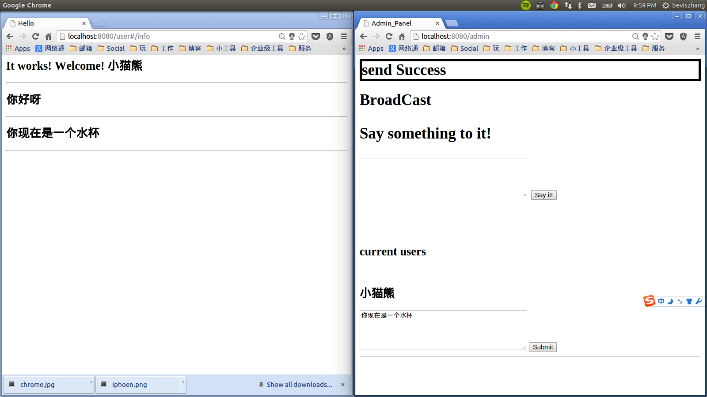

# Stanford ME310课程工具 --- For Prototype
<br
<br>

# 课题

> Multi-devices Collaboration to improve people's productivity.

More info in [Here](http://www.stanford.edu/group/me310/me310_2014/)

<br>
<br>
<br><br>


# 因此

我们必须设计让users提高效率的工具, 而且工具涉及到多个设备或者事物之间交互. 可是__难点在于:__ *如何得知用户的真实想法?*


## 为什么难

因为用户自己可能都不那么完全清楚自己想要什么, 而我们的调研方式只能是把一些想法说给用户听, 再听取他们的意见.

## 这样不好


- 就像之前说的, 用户自己也不很清楚, 所以可能提供不了太多信息

- 用户对你所描述的产品不可能有真实的体验, (因为没有做出来), 所以给出的建议也很难参考

<br><br><br><br>
# 解决方法

我们需要给用户一个场景, 让用户真实体验到多物体间交互, 这样调研才有意义.


__假设我们要和这个杯子和旁边的水壶交互__


## 老方法


__用survey__

<br><br><br><br>
## 我认为可以有的新方法


__手机绑在水杯和水壶上__
<br>

把手机绑在水杯和水壶上, 当被调研的用户, 和水杯, 和水壶交互时, 通过电脑__来控制手机上app__, 电脑中心管控让手机现实它作为一个"智能水杯"应该显示的信息
<br>

输出相应内容, 比如

- 水量
- 水温
- whatever you want to survey

这样就达到了比较好模拟现实场景的调研目的.
<br><br>
# 需要做什么

## 现有技术

很容易实现, 用QQ群, 微信群就行, 只要你舍得手机, 但是我觉得这样给用户体验不好, 没有调研的感觉, 所以决定自己写, 需要写一个APP来实现这个功能.


<br><br><br><br>
# 现状

## 基本功能

在电脑浏览器内功能已经实现, 看截图:

- 登入, 写入自己名字

- ok, 登陆成功

- 在管理页面可以看到该设备, 并且对其发送消息, 这里他可以是一个水杯, 让它展示消息, 模拟与用户交互!


一旦用户断开链接, 则admin页面相应用户消失.


<br><br><br><br>
## 使用技术

使用了
- angularjs
- node express 我没有用自己写得[gliding](https://github.com/BenBBear/gliding)框架是因为目前那个框架有很多设计上的问题, 等自己有时间要把他redesign.
- socket.io


## 下一步计划

- 开发app, 因为网页版已经成功, 使用ionic这样的html5开发框架会非常容易简单.

- 部署到云上

- 支持图片传输显示功能

- 更方便的admin页面

- 更好的网页界面


# 如何用

## 安装
保证你的电脑安装好了[node](http://nodejs.org)还有[npm](https://www.npmjs.org/).

```shell
git clone <this repo address>
cd <dir_this_repo>
npm install  ## dependency
cd public
bower install ## dependency
```

## 使用

```shell
node  /path/to/server.js
```

之后打开浏览器`http://localhost:8080/user`来"注册设备", `http://localhost:8080/admin`来和设备传信息, 可以单独发送和广播.


## 其他

- 是故意不做成聊天的:)
